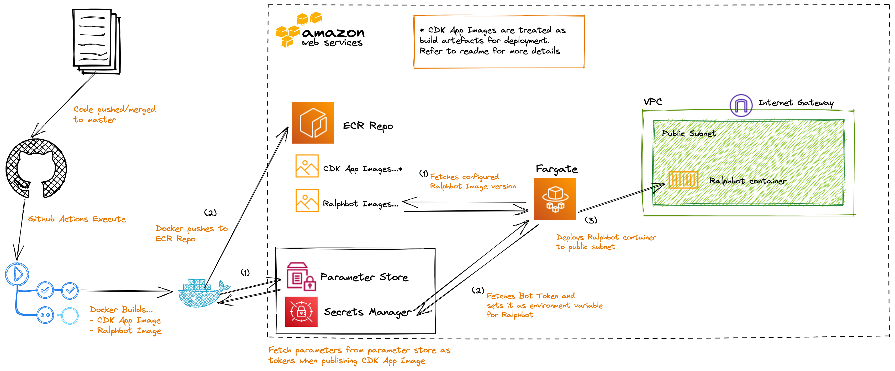

# ralphbot

[](https://github.com/therealvio-org/ralphbot/actions/workflows/ralphbot-deploy.yaml)
[](https://github.com/therealvio-org/ralphbot/actions/workflows/ralphbot-ops-lint.yaml)
[](https://github.com/therealvio-org/ralphbot/actions/workflows/ralphbot-src-lint.yaml)

A humble discord bot

## Tools

For programming language, and other tools, check out `.tool-versions` (I tend to use asdf where I can!)

- [asdf version manager](https://asdf-vm.com/guide/getting-started.html#getting-started)
- [AWS CLI v2](https://docs.aws.amazon.com/cli/latest/userguide/getting-started-version.html)
- [Docker](https://docs.docker.com/get-docker/)

## Environment Variables

Personally, I use `direnv` (read more [here](https://direnv.net/)) to manage my environment variables via a `.envrc` file in my projects, including this one.

Check out `.envrc_example` for getting an idea on what environment variables you should set up for local development purposes. The sub-sections here elaborate on specific variables that are worth calling out.

### Use of BOT_TOKEN

This environment variable **needs** to be defined for the bot to come online. It is up to you if you want to have different tokens for different versions of the bot (e.g. `development` and `production`).

When deployed in "production", because the bot is running as a containerised app, the environment variable can be passed through a secrets manager tool, like in [AWS ECS](https://docs.aws.amazon.com/AmazonECS/latest/developerguide/specifying-sensitive-data-secrets.html#secrets-envvar).

All in all, this makes local development portable, and doesn't require production-specific logic to be put in place.

Ultimately it is up to you how you want to define the environment variable, though you need to make sure not to leak any tokens in source code :^)

### Use of GUILD_ID

GUILD_ID is the [ID of your discord server](https://support.discord.com/hc/en-us/articles/206346498). This value can be passed optionally.
The benefit of passing this value as an environment variable into the bot is that command registration happens instantly for that server. This is incredibly useful for developing commands getting a faster feedback loop. When this value isn't passed, then the command is registered `globally`, meaning that it needs to propage to Discord's endpoints and can take between 40 minutes to an hour.

For more details, refer to the [Discord docs on this](https://discord.com/developers/docs/interactions/application-commands#making-a-guild-command)

## Working with the container

Before getting started make sure:

- You have Docker (or any appropriate containerisation tool) installed;
- Have `make` installed;
- You have `direnv` installed, and a `.envrc` file defined as per `.envrc_example`; and
- Your `$(pwd)` is set to `src/`;

you only really need to use:

```sh
make local
```

In the `./src/Makefile`, you can see the requisite targets that are used prior to running the `docker-compose` command.

## Infrastructure

Ralphbot's infrastructure stack is defined in `./ops`. This is an AWS CDK Stack.

If you intend on forking, or cloning this project for your own use, you do not necessarily need to use the CDK Stack, and can define your own infrastructure stack as you please (that's why containers are awesome!).

Below is a diagram of the infrastructure stack defined in `./ops` (this may not be up to date as the CDK stack updates, but gives a general idea on how it all comes together):



### Regarding CDK Stack as a Container Image

By creating the CDK stack as a container image, it allows the CDK stack to be run in a vacuum since all the necessary `nodejs` modules, toolings, e.t.c. to be available as a portable means to deploy the CDK stack on its own. That way, to deploy the CDK stack, all that needs to be done is having a valid AWS session, and passing some environment variables into `docker run`, referencing the CDK Stack iamge along with a `ci-deploy` argument.

This is especially handy when using hosted CI/CD services like Github Actions where toolings need to be specified as arguments, that can all be managed within the container - it's just a matter of telling the CI/CD services to run Docker as before (which is almost guaranteed to be available these days).

### Handling BOT_TOKEN as an AWS Secrets Manager secret

It is important to note, that there are some limitations with AWS CDK when it comes to interacting with Secrets manager:

When referencing the ARN of a secret in the CDK stack, CDK deliberately does not insert the trialing characters, and in some scenarios it substitutes them as: `-?????`, requiring a means to update the reference where appropriate. To get around this, you can "predict" the ARN by constructing it, or reference appropriate properties and insert the suffix.

However, because this is a public repository, revealing details such as this in the open would be a bad idea :stuck_out_tongue_closed_eyes:. So, an AWS Systems Manager Parameter is used to fulfil this, so that during the deploy of the CDK stack, the Parameter value is inserted.

#### Deploying the Secret and Parameter Store value

If this is the first time the stack needs to be deployed (or is being redeployed), assuming you have AWS CLI installed, and a valid AWS exec session running, before attempting to deploy the CDK stack, you must:

**IMPORTANT**: Make sure to **NOT** commit changes of the variable definitions in the shell script, or else you risk leaking secrets when you perform the steps below. It's recommended you do these changes in a throw-away git branch, and then delete the branch when you're done.

1. Open the `./ops/bin/create-bot-token-secret.sh` file, and modify the variables appropriately, then save your changes.
2. Run the script: `./ops/bin/create-bot-token-secret.sh`
3. Log in to the AWS console the secrets have been deployed to
4. Locate the Secret in the `Secrets Manager` console
5. Make note of the trialing characters of the Secret ARN. Denoted by `-abcde`, copy this value.
6. Open the `./ops/bin/create-secret-suffix-parameter.sh` file, and modify the variables appropriately, then save your changes.
   - This is the part where you paste the `-abcde` string into the appropriate variable
7. Run the script: `./ops/bin/create-secret-suffix-parameter.sh`

With this completed, the Bot Token is deployed as an AWS Secrets Manager Secret, and the suffix to the Secret ARN is an AWS Systems Manager Parameter. And no secrets are leaked in plaintext in source code :grin:
